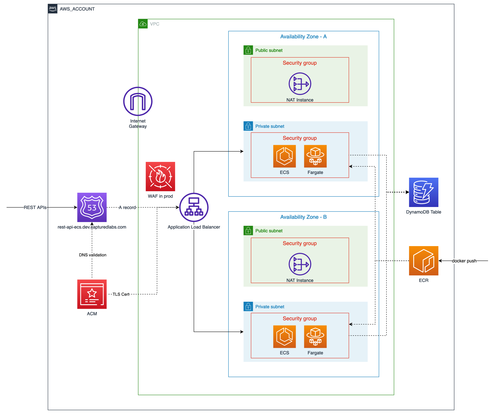

# Real life CDK TypeScript

> A collection of CDK 2 demo projects in TypeScript, based off some projects I've done and lessons I've learned.

[](https://github.com/chrischenyc/real-life-cdk-typescript/actions/workflows/cicd.yml)

## Contents

-   [Tech](#tech)
-   [npm Scripts](#npm-scripts)
-   [Manual Deployment](#manual-deployment)
-   [Demo Projects](#demo-projects)
-   [Contributing](CONTRIBUTING.md)

## Tech

-   [lerna](https://lerna.js.org/): this is a monorepo managed learn. Each lerna package can be deployed as a standalone AWS CloudFormation stack.
-   Node.js 16.x:
    -   AWS CDK requires Node.js [LTS releases](https://nodejs.org/en/about/releases/).
    -   [AWS Lambda runtime](https://docs.aws.amazon.com/lambda/latest/dg/lambda-runtimes.html) supports up to Node.js 16.x.
    -   Recommended using [nvm](https://github.com/nvm-sh/nvm) to manage your local Node.js versions (see [.nvmrc](.nvmrc)). For zsh users, plugin [zsh-nvm](https://github.com/lukechilds/zsh-nvm) can be handy.
-   Typescript 4.x
-   AWS CDK 2
-   AWS SDK for JavaScript 3
-   Prettier, ESlint, Commitlint, lint-staged
-   Jest
-   AWS services per system architecture diagrams

## npm Scripts

List available npm scripts and their descriptions here.

-   `lint`: lint codebase with ESlint
-   `commit`: preferred way to create a git commit
-   `test`: run unit tests
-   `deploy`: deploy all projects
-   `deploy:rest-api-ecs`: deploy [REST API on ECS with Fargate](#rest-api-on-ecs-with-fargate)

## Manual Deployment

-   make sure your command line has sufficient access to the target AWS account. recommend [Configuring the AWS CLI to use AWS IAM Identity Center (successor to AWS Single Sign-On)](https://docs.aws.amazon.com/cli/latest/userguide/cli-configure-sso.html).

-   [bootstrap](https://docs.aws.amazon.com/cdk/v2/guide/bootstrapping.html) CDK in the target AWS account, if it hasn't been.

```bash
# deploy everything
npm run deploy
```

```bash
# deploy package @capturedlabs/rest-api-ecs
npm run deploy --scope=@capturedlabs/rest-api-ecs
```

## Demo Projects

-   [REST API on ECS with Fargate](./packages/rest-api-ecs/README.md)

    

    [test the live demo](./packages/rest-api-ecs/README.md#live-api-endpoints)
