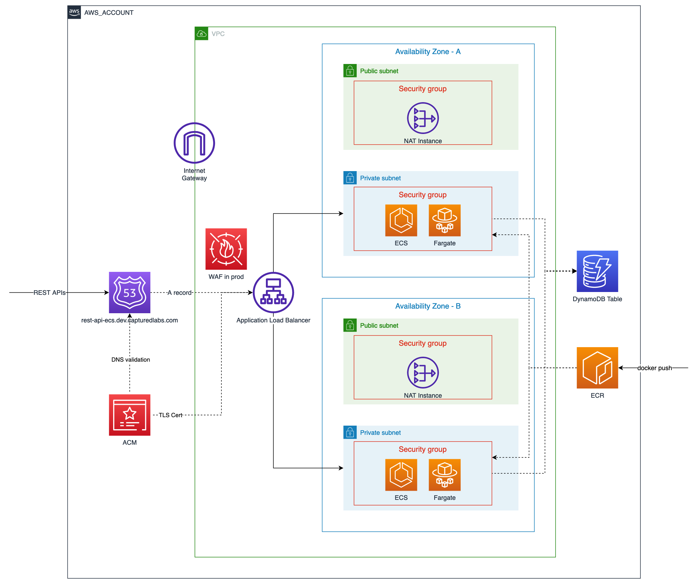

# [Express.js](https://expressjs.com/) REST API server hosted on [AWS ECS](https://docs.aws.amazon.com/AmazonECS/latest/developerguide/Welcome.html) with [Fargate](https://docs.aws.amazon.com/AmazonECS/latest/userguide/what-is-fargate.html)

> A vanilla express.js project in TypeScript. It provides a few simple RESTful API endpoints for demonstration purpose, nothing fancy.

## Contents

-   [Solution Architecture](#solution-architecture)
-   [Local Development](#local-development)
-   [Manual Deployment](#manual-deployment)
-   [Test Live Deployment](#test-live-deployment)

## Solution Architecture



## Local Development

```bash
# build the latest docker image, expose port 3000
docker build -t api-server:latest --build-arg PORT=3000 .

# run the docker image
docker run -d --rm --env-file .env -p 3000:3000 api-server:latest

# test GET /
curl http://localhost:3000

# you should see {"message":"server is up 🚀"}
```

## Manual Deployment

-   make sure your command line has sufficient access to the target AWS account. recommend [Configuring the AWS CLI to use AWS IAM Identity Center (successor to AWS Single Sign-On)](https://docs.aws.amazon.com/cli/latest/userguide/cli-configure-sso.html).

-   [bootstrap](https://docs.aws.amazon.com/cdk/v2/guide/bootstrapping.html) CDK in the target AWS account, if it hasn't been done.

-   create an `.env` file by duplicating `.env.template`, example:

    ```env
    AWS_ACCOUNT=111222333444
    AWS_REGION=ap-southeast-2
    AWS_HOSTED_ZONE_DOMAIN=dev.example.com
    ENV=dev
    PORT=3000
    ```

-   make sure the root domain (`dev.example.com` in the example .env file) has been hosted as a [Route53 public hosted zone](https://docs.aws.amazon.com/Route53/latest/DeveloperGuide/AboutHZWorkingWith.html), and its NS records can be resolved on the public internet.

```bash
  npm install
  npm run deploy
```

## Test Live Deployment

> I'm hosting it in my personal AWS account, be mercy 🙈

```bash
# test deployed REST API GET /
curl -i \
-X GET \
https://rest-api-ecs.dev.capturedlabs.com

# expected output
HTTP/2 200
date: Wed, 27 Jul 2022 21:29:50 GMT
content-type: application/json; charset=utf-8
content-length: 31
x-powered-by: Express
access-control-allow-origin: *
etag: W/"1f-grMtbL5VYulNqAmFyqX/2Lp3EyY"

{"message":"server is up 🚀"}
```
