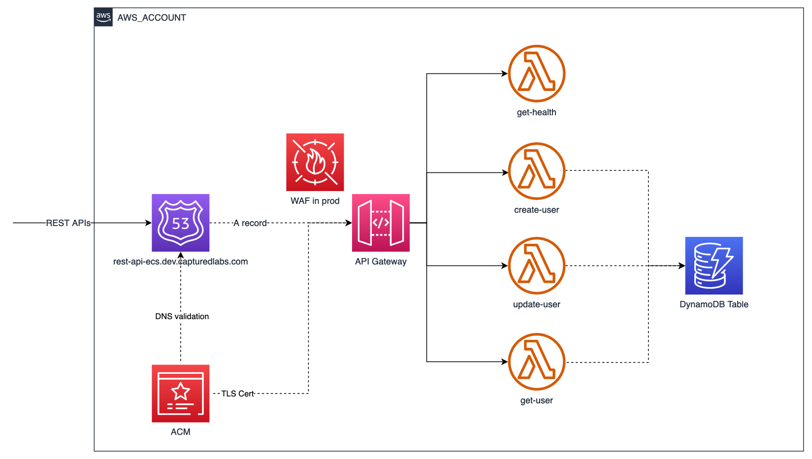

# Simple REST API server powered by AWS Serverless services

> A vanilla express.js project in TypeScript. It provides a few simple RESTful API endpoints for demonstration purposes, nothing fancy.

## Contents

-   [Solution Architecture](#solution-architecture)
-   [Local Development](#local-development)
-   [Manual Deployment](#manual-deployment)
-   [Live API Endpoints](#live-api-endpoints)
-   [Database Schema](#database-schema)

## Solution Architecture



diagram raw file (draw.io format): [https://drive.google.com/file/d/1mlh_tGtY4NF3XTauX2NC_HOkPyb775gI/view?usp=sharing](https://drive.google.com/file/d/1mlh_tGtY4NF3XTauX2NC_HOkPyb775gI/view?usp=sharing)

## Local Development

TODO: use [LocalStack](https://github.com/localstack/localstack) for local development

## Manual Deployment

-   make sure your command line has sufficient access to the target AWS account. recommend [Configuring the AWS CLI to use AWS IAM Identity Center (successor to AWS Single Sign-On)](https://docs.aws.amazon.com/cli/latest/userguide/cli-configure-sso.html).

-   [bootstrap](https://docs.aws.amazon.com/cdk/v2/guide/bootstrapping.html) CDK in the target AWS account, if it hasn't been done.

-   create an `.env` file by duplicating `.env.template`, example:

    ```env
    AWS_ACCOUNT=111222333444
    AWS_REGION=ap-southeast-2
    AWS_HOSTED_ZONE_DOMAIN=dev.example.com
    ENV=dev
    AWS_SECRETS_MANAGER_API_KEY_SECRET=rest-api-serverless-dev/api-key #optional
    ```

-   make sure the root domain (`dev.example.com` in the example .env file) has been hosted as a [Route53 public hosted zone](https://docs.aws.amazon.com/Route53/latest/DeveloperGuide/AboutHZWorkingWith.html), and its NS records can be resolved on the public internet.

```bash
  npm install
  npx lerna run deploy --scope=@capturedlabs/rest-api-serverless
```

## Live API Endpoints

> I'm hosting it in my personal AWS account, be merciful 🙈

```bash
# GET / - health check
curl -X GET \
https://rest-api-serverless.dev.capturedlabs.com/health
# expected output:
# {"message":"server is up 🚀"}

# POST /users - create a user
curl -X POST \
-H "Content-Type: application/json" \
-H "x-api-key: 5bU77uF*sHWga2lf9023=jl" \
-d '{"username":"marten", "fullName": "Marten Trendle", "email": "mtrendle2@umich.edu"}' \
https://rest-api-serverless.dev.capturedlabs.com/users

# PATCH /users/:username - update a user
curl -X PATCH \
-H "Content-Type: application/json" \
-H "x-api-key: 5bU77uF*sHWga2lf9023=jl" \
-d '{"address":"4 La Follette Pass"}' \
https://rest-api-serverless.dev.capturedlabs.com/users/marten

# GET /users/:username - get a user
curl -X GET \
https://rest-api-serverless.dev.capturedlabs.com/users/marten

# expected output:
# {"username":"marten","email":"mtrendle2@umich.edu","fullName":"Marten Trendle","address":"4 La Follette Pass"}

```

## Database Schema

To make things simple, I borrowed the example single table design from Alex Debrie's blog [The What, Why, and When of Single-Table Design with DynamoDB](https://www.alexdebrie.com/posts/dynamodb-single-table/). Choosing underlying database service is not the concern of this demo project. DynamoDB is chosen because of its on-demand pricing model.


